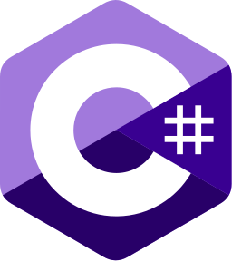
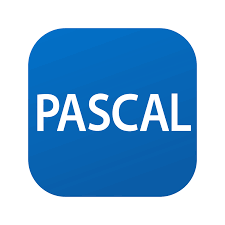
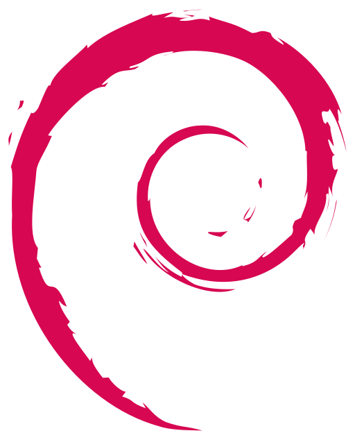
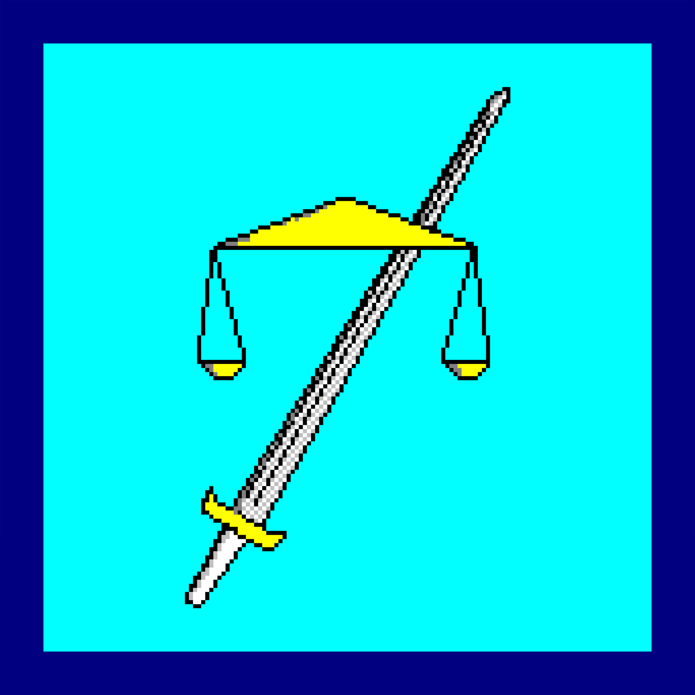

  

<h1 align="center">Привет мир, я <a href="https://t.me/A_2173/" target="_blank">Iwakawa-2173</a></h1>

# Обо мне

Занимаюсь разработкой необычных алгоритмов на C++ для научно-учебной группы  ИТ МГППУ (не всегда успешно)  
Имею опыт разработки консольных приложений, фронтенда (к нему меня допускать нельзя!), а также собственного языка программирования (он во всех смыслах ужасен, потому я планирую оставить его, как экспонат для истории, и начать разработку с самого начала).
 
А также я очень люблю математику!

# Без лишних предисловий - то, с чем приходилось работать 

Что-то из нижеперечисленного использую всегда, а что-то удалось хотя бы чуть-чуть потрогать в плане учёбы.

### Языки программирования (без веба)

  
  
  
  
  
  

### Веб-разработка (её языки, фреймворки, библиотеки и инструменты)

  
  
  
  
  
  
  
  
  
  

### В каких IDE могу работать

  
  
  
  
  

### Сети

  
  

### Языки для баз данных

  

### Microsoft Office

  
  
  

### Графика

  

### С какими ОС приходилось сталкиваться

  
  
  
  
  
  
  

### Нейросети (а почему бы и нет?)

  
  

## 📊 Немного статистики

## ⚡ Зачем я вам в команде
Если вдруг вы уговорили меня принять участие в вашем проекте, то я смогу помочь, примерно, следующим:
- Если задача мне очень интересна, то я могу по 12 часов в день работать над решением (если на то у меня будет свободное время и не будет обмороков)
- Могу переписать процедурный, прибитый гвоздями код в ООП-шный с расширяемостью системы (знаю это по очень негативному личному опыту со своим же кодом)
- Могу разработать какой-нибудь алгоритм и придумать архитектуру (вопрос реализации архитектуры сложен, а вот реализовать алгоритм мне гораздо проще)
- Ценой небольших (а может и больших) усилий могу попробовать устроить вам локальную сеть
- Ценой небольших усилий могу организовать веб-сервер (мне главное иметь доступ к документации)

## 🤔 Мои недостатки
Разумеется, я могу сделать не всё, что захочу или вы захотите.
- У меня странные предпочтения, потому к фронтенду меня лучше не допускать
- Мне очень сложно даётся синтаксис языков и системное мышление - я не могу просто так взять и написать большое приложение, которое будет работать (но могу решать мелкие и локальыне задачи)
- У меня две крайности: спагетифкация кода с кошмаром любого архитектора и "оверинженеринг" с безумием дробления функционала на фукнции/модули (в обоих случаях всё сложно)
- В одних областях я, может быть и знаю что-то, но в других, мне кажется, моя безграмотность не знает границ
- Учитывайте, что для работы даже по указанным мной выше технологиям мне всё равно требуется документация, интернет и доступ к моей кодовой базе, так как читать код проще, чем писать - я не смогу в изоляции только с чистым компилятором/интерпретатором повторить всё то, что мной сделано

## 🌱 Мои проекты
Если кратко, то я стараюсь попробовать всё, что кажется мне удивительным. Вот примерный список проектов (не только кодирование, но и сетевая область деятельности):
<ul>
  <li><a href="https://github.com/Iwakawa-2173/tibetan-buddhism-gpt-2" target="_blank">Настольное Windows-приложение-чат с русскоязычной GPT-2, которая была мной дообучена на буддийских текстах. (доведено до конца - есть планы взять более новую модель и улучшить)</a></li>
  <li><a href="https://github.com/Iwakawa-2173/neural_network_sample" target="_blank">Учебный пример с небольшой нейронной сетью и объяснением (доведено до конца - этот проект можно использовать в образовательных целях)</a></li>
  <li><a href="https://github.com/Iwakawa-2173/Kikkago" target="_blank">Полный по Тьюрингу интерпретируемый язык программирования (доведено до конца - результат агоничен даже для моего разума)</a></li>
  <li>Собственная ОС (не получилось даже загрузчик написать)</li>
  <li><a href="https://github.com/Iwakawa-2173/Huawen-IME-system" target="_blank">IME-клавиатура для конланга (доведено до конца - мне очень нравится результат)</a></li>
  <li><a href="https://github.com/Iwakawa-2173/MR-logical-mechanism" target="_blank">Логический механизм с самоопределением операций (доведено до конца - в результате теперь я могу в ООП)</a></li>
  <li><a href="https://github.com/Iwakawa-2173/MR-logical-mechanism" target="_blank">Нейросеть на основе логических механизмов с самоопределением операций, как нейронов (в процессе)</a></li>
  <li>Онлайн-радио через Apache, VLC и Icecast, пропущенное в есть Tor (всё получилось отлично - но северокорейская поп-музыка что-то понравилась только мне, зато технология освоена :D) (репозитория нет, так как это было полгода назад, и там просто в конфигах прописать 127.0.0.1 и свою onion-ссылку, и всё будет работать)</li>
  <li><a href="https://github.com/Iwakawa-2173/4d-game" target="_blank">Забавная четырёхмерная игра с милыми гиперкубами и гиперсферами (для проф-экзамена в ВУЗе)</a></li>
</ul>

## 🔭 Мои интересы
- Интересуюсь сетями (Tor и Yggdrasil, например)
- Интересуюсь математикой (в частности матлогикой, что позволило расширить Логический механизм с самоопределением операций)
- Интересуюсь нейросетями (можете видеть по некоторым репозиториям)
- Интересуюсь языками программирования (их внутренним устройством, хочу создать свой, который будет, если хуже других во многих аспектах, то хотя бы будет запоминающимся)
- Интересуюсь абстрактной информатикой по типу теории вычислимости, матлогики, теории компиляции и интерпретации (так как ценю наследие Ады Лавлейс, Алана Тьюринга, Эмиля Поста, Кэтлин Бут и Тэрри Дэвиса)

## 📈 Мои планы
- Довести до конца проект с нейросетью на основе логических механизмов
- Разрботать и реализовать собственный язык программирования с хорошим синтаксисом
- Поднять что-нибудь в Yggdrasil (мне лень, да и даже, если получится, я просто сообщу здесь об этом и всё)
- Написать ма-а-а-аленькую операционную систему (очень и очень нескоро!)
- Разработать свою маленькую базу данных и крохотную СУБД для неё (может быть даже со своим языком! Однако это уже очень далёкое будущее)

## ⭐ Достигнутые цели
- Освоить нейросети, а именно написать что-нибудь маленькое и дообучить уже существующую

Как вы уже могли понять, я очень хочу окружить себя самодельными вещами, чтобы... просто были, и чтобы хоть как-то не зависеть от корпораций и государств. Ну и всё же своё - это своё, родное, пусть и такое кособочное, как Kikkago (кстати, а ведь был же ещё и Haikugo, и вот на него без слёз испуга не взглянешь, да, Kikkago - это моя вторая попытка, в ней хотя бы принт для всех данных один, а не сто принтов на сто типов данных (да, и такое тоже было...)).

# 💬 Как связаться со мной
Либо почта, либо телеграмм - на ваш выбор (иконки кликабельны)
 

  
  

# 🏵️ Эта часть просто обязана была оказаться здесь
Сделано через yml (нагло скопировано)

<picture>
  <source media="(prefers-color-scheme: dark)" srcset="https://raw.githubusercontent.com/Iwakawa-2173/Iwakawa-2173/output/pacman-contribution-graph-dark.svg">
  <source media="(prefers-color-scheme: light)" srcset="https://raw.githubusercontent.com/Iwakawa-2173/Iwakawa-2173/output/pacman-contribution-graph.svg">
  
</picture>

_generated with [abozanona/pacman-contribution-graph](https://abozanona.github.io/pacman-contribution-graph/)_

# 😄 И посмеёмся напоследок - анекдот дня
Можно подумать, будто всё, что выше, не является смешным...

# 🈳 Ах да! Самое важное!
Гифка наверху замурыжена через Photshop и стоковые gif (+онлайн-генератор gif по надписи). Внизу цитата Председателя Мао:
> 吸收那些用得着的东西，拒绝那些用不着的东西，增加那些自己所特有的东西。
——《毛泽东选集》第2版第1卷第181页

Перевод на русский:
> Впитывайте полезное, отбрасывайте ненужное и добавляйте то, что уникально для вас.
— Избранные произведения Мао Цзэдуна, 2-е издание, том 1, стр. 181

Лично мне кажется, что эта цитата идеально отражает правильный подход к программированию, несмотря на то, что она была сказана в совершенно ином контексте.

P.S. На эту репу ушло 5 часов, если верить сообщениям о коммитах.

P.P.S. За десять пачек сухариков и сет роллов и суши сделаю вам такой же.

